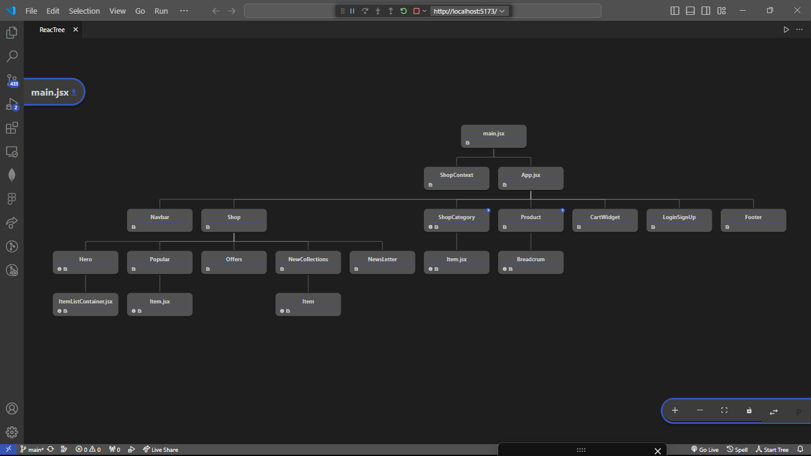

---

Imagen de la estructura del proyecto hasta la 2da Pre/entrega

---

Notas Pre.entrega:

- Para el filtrado se está usando las categorías Hombre, Mujer y Niños para renderizar la información entre componentes y rutas.
- Luego agregamos al botón "Explore mas" la función (getAllProducts) que agrega una fila adicional de productos al DOM
- 
-
